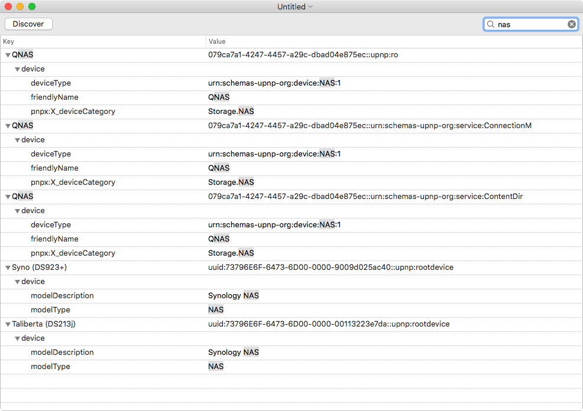

# SSDP Browser (macOS)

This is a macOS program for browsing SSDP or UPnP devices that are announced on the local network.

It looks on *all* interfaces, not just only on the default interface. Which means that it will find devices that are on a secondary subnet, for instance.

It uses Cocoa Binding excessively and is quite compact. It also uses a smart method for identifying the nodes for dynamic update of the displayed names depending on the search term, despite using an `NSTreeController`.

The source includes the following 3rd party sources:

- BlueSocket (Apache 2.0 License).
- SSDPClient (MIT License), updated to support multiple interfaces.

It was tested on macOS 10.13, built with Xcode 10.1

